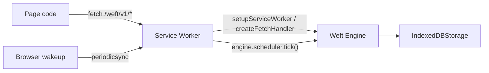

# Service Worker

Weft can run a browser-local engine behind a Service Worker. The page talks to the engine through the same HTTP shape it would use for a remote Weft server, but requests under a path like `/weft/` are intercepted locally and backed by IndexedDB.

This guide covers two paths: `setupServiceWorker()` for the standard PWA case, and the lower-level `createFetchHandler()` / `createLifecycleHandlers()` / `createPeriodicSyncHandler()` factories when you need explicit listener attachment.

## Mental model

In server mode, a long-lived Bun process owns the engine, storage, HTTP routes, and timer scheduler. In browser mode, the Service Worker owns those same responsibilities within the limits of the browser runtime.



The Service Worker is the browser-side request owner. It intercepts requests, delegates matching ones to Weft, and lets unrelated requests continue to the network.

## Which path should I use?

**Use `setupServiceWorker()` when:**

- You're starting a new PWA and want one call to wire up storage, engine, scheduler, and the four event listeners (`install`, `activate`, `fetch`, `periodicsync`).
- The defaults work for you: `/weft/` path prefix, `'weft'` IndexedDB database name, `'weft-timers'` periodic-sync tag.
- You're happy registering workflows inside a callback that runs before any handler does real work.

**Use the lower-level handlers when:**

- You need to register workflows synchronously, before any `await`. This matters in some bundler setups or when migrating from an existing manual Service Worker.
- You already have an `Engine` instance you want to reuse (for example, a singleton wired up in shared code) and you want full control over how listeners attach.
- You need to interleave Weft's listeners with other Service Worker logic (custom caching, request rewrites, message handlers) at the listener level rather than around the helper.
- You want a custom path for one of the listeners, or want to skip one entirely (for instance, no Periodic Background Sync at all).

Either path works. The helper's escape hatches let you bring your own engine or storage, so you can start with `setupServiceWorker()` and reach for the manual API only when you hit a constraint.

## What `setupServiceWorker()` does — and doesn't

The helper handles:

- Constructs `IndexedDBStorage` with the database name you choose (default `'weft'`), or accepts a pre-built storage you pass in.
- Constructs an `Engine` against that storage, or accepts a pre-built engine (the engine's storage must match).
- Constructs a `ServiceWorkerScheduler` and wires it to `engine.fireTimer(entry)`.
- Attaches `install`, `activate`, `fetch`, and `periodicsync` listeners on `self`.
- Calls `self.skipWaiting()` on `install` and `self.clients.claim()` on `activate` when those APIs exist.
- Awaits your `register` callback (if provided) before letting fetch and periodic-sync handlers do real work. Registration failures convert to a 503 response on the next fetch.

It does not handle, and you still need to configure yourself:

- **Bundling.** The Service Worker has to be a separate bundle entry point. Configure your bundler (Vite, esbuild, Rspack, Workbox, etc.) to emit `sw.js` (or whatever name you register) at a stable URL.
- **`navigator.serviceWorker.register()`.** Page code still calls `register('/sw.js', { scope, type })`. Weft's helper runs inside the worker; it doesn't reach back into the page.
- **Cache strategies.** If you want service-worker-level HTTP caching for application assets, layer that yourself. Weft's `fetch` listener only intercepts requests under the path prefix.
- **Browser permissions for Periodic Background Sync.** Page code is responsible for `registration.periodicSync.register('weft-timers', { minInterval })` and the permission query.
- **Workflow recovery.** `setupServiceWorker()` does not call `engine.recoverAll()` for you. If you want previously-running workflows to resume after the Service Worker is evaluated fresh (browser update, eviction, or first install of a new version), call `engine.recoverAll()` yourself. The recommended placement is inside the `register` callback, after registering activities and workflows. See [Workflow recovery](#workflow-recovery) below.

## Quick start with `setupServiceWorker()`

The minimal worker entry:

```typescript partial
/// <reference lib="webworker" />

import { activity } from 'weft';
import { setupServiceWorker } from 'weft/service-worker';

const formatGreeting = activity({
  name: 'formatGreeting',
  execute: async (input: { name: string }) => `Hello, ${input.name}!`,
});

const setup = await setupServiceWorker({
  pathPrefix: '/weft/',
  async register(engine) {
    engine.register(formatGreeting);
    engine.register('welcome', async function* (ctx, input: { name: string }) {
      const greeting = yield* ctx.run(formatGreeting, { name: input.name });
      yield* ctx.sleep('5s');
      return { greeting };
    });

    // Resume any workflows that were running when the previous worker was terminated.
    await engine.recoverAll();
  },
});

// `setup` exposes `engine`, `storage`, `scheduler`, and `ready` if you need them.
void setup;
```

The `register` callback receives the engine. Register activities and workflows inside it, then call `engine.recoverAll()` so previously-running workflows resume on this worker evaluation. The helper awaits `register` before fetch and periodic-sync events trigger real work, so your handlers see fully-registered workflows _and_ recovery is complete before serving traffic.

`setupServiceWorker` is safe to call once per worker evaluation. Concurrent calls during initialization converge on the same result. Calling it again after it's already attached throws.

If `setupServiceWorker` is called outside a Service Worker scope (for example, accidentally from page code), it rejects with a clear error rather than silently doing nothing.

## Page registration

Register the Service Worker from page code, wait until it's ready, register Periodic Background Sync when available, then use the HTTP client against the local path prefix.

```typescript partial
import { HttpClient } from 'weft/client';

const registration = await navigator.serviceWorker.register('/sw.js', {
  scope: '/',
  type: 'module',
});

await navigator.serviceWorker.ready;

type PeriodicSyncRegistration = ServiceWorkerRegistration & {
  periodicSync: {
    register(tag: string, options: { minInterval: number }): Promise<void>;
  };
};

function hasPeriodicSync(
  registration: ServiceWorkerRegistration,
): registration is PeriodicSyncRegistration {
  return 'periodicSync' in registration;
}

async function registerWeftPeriodicSync(registration: ServiceWorkerRegistration): Promise<boolean> {
  if (!hasPeriodicSync(registration)) return false;

  const permission = await navigator.permissions
    .query({ name: 'periodic-background-sync' as PermissionName })
    .catch(() => undefined);

  if (permission?.state === 'denied') return false;

  try {
    await registration.periodicSync.register('weft-timers', {
      minInterval: 60_000,
    });
    return true;
  } catch {
    return false;
  }
}

const periodicSyncRegistered = await registerWeftPeriodicSync(registration);

if (!periodicSyncRegistered) {
  const tickWeft = () => registration.active?.postMessage({ type: 'weft:tick' });
  window.setInterval(tickWeft, 60_000);
  document.addEventListener('visibilitychange', () => {
    if (document.visibilityState === 'visible') tickWeft();
  });
}

const client = new HttpClient({ baseUrl: '/weft' });
const handle = await client.start('welcome', { name: 'Ada' }, { id: 'welcome:ada' });
const result = await handle.result();
void result;
```

`HttpClient` appends `/v1/*` to the `baseUrl`, so `baseUrl: '/weft'` sends workflow starts to `/weft/v1/workflows`. The Service Worker strips `/weft/`, and the engine sees `/v1/workflows`.

The `weft-timers` tag on `periodicSync.register` must match the `periodicSyncTag` option (default `'weft-timers'`) on the worker side.

## Periodic Background Sync and fallback

`ctx.sleep()` persists timer records in IndexedDB. A sleeping workflow does not advance until something wakes the Service Worker and calls `engine.scheduler.tick()`.

Periodic Background Sync is the best browser primitive for this when available. Browser support is uneven:

- [MDN marks Periodic Background Sync](https://developer.mozilla.org/en-US/docs/Web/API/Web_Periodic_Background_Synchronization_API) as experimental and limited availability.
- [web.dev lists Periodic Background Sync](https://web.dev/patterns/web-apps/periodic-background-sync) as supported in Chrome and Edge, but not Firefox or Safari.
- The `minInterval` is a request, not a guarantee. The browser may fire later (or not at all) under power, storage, permission, or engagement constraints.

When Periodic Background Sync is unavailable, the page-driven fallback above polls the worker every 60 seconds while a controlled tab is open. When the tab is closed, sleeping workflows pause until the user comes back. Design browser workflows accordingly: opportunistic local durability, not a guaranteed background-compute environment.

The page sends `{ type: 'weft:tick' }` on the fallback timer. The default Service Worker `setupServiceWorker()` configuration does **not** install a `message` listener for this, so if you rely on the page-tick fallback, add one yourself in the worker:

```typescript partial
self.addEventListener('message', (event) => {
  if (event.data?.type !== 'weft:tick') return;
  event.waitUntil(setup.scheduler.tick());
});
```

`setup.scheduler` is returned by `setupServiceWorker()`.

## Workflow recovery

Service Workers can be evaluated fresh at any time: browser update, eviction, first install of a new version, manual unregister/reregister during development. When that happens, the new evaluation has zero in-memory workflow state — but IndexedDB still holds checkpoints for any workflow that was running when the previous worker was terminated. Those workflows resume only if you call `engine.recoverAll()`.

Neither `setupServiceWorker()` nor `createFetchHandler()` nor the scheduler does this for you. The recommended placement:

- **With `setupServiceWorker()`**: call `await engine.recoverAll()` at the end of your `register` callback, after registering activities and workflows. The helper awaits `register` before letting fetch/periodicsync handlers do real work, so recovery completes before steady-state traffic begins.
- **With manual setup**: call `await engine.recoverAll()` at module top-level, after the engine is constructed and workflows are registered, but before attaching the `fetch` listener. The Advanced section below shows this pattern.

If you skip recovery, sleeping or in-flight workflows from the previous worker evaluation stay parked in IndexedDB until something else triggers a recovery — usually a manual call after the user reports "my workflow is stuck." Don't ship without it.

## Browser support notes

- [MDN documents Service Workers](https://developer.mozilla.org/en-US/docs/Web/API/Service_Worker_API) as secure-context APIs: production pages need HTTPS. `http://localhost` is treated as secure for local development.
- Service Workers can be terminated by the browser shortly after an event finishes. The engine's checkpoint-and-recover model is what makes this safe: in-flight workflow state lives in IndexedDB, and `engine.recoverAll()` resumes from the last checkpoint when called.
- **You are responsible for calling `engine.recoverAll()` after a fresh worker evaluation if you want previously-running workflows to resume.** Neither `setupServiceWorker()` nor `createFetchHandler()` nor the scheduler calls it for you. See [Workflow recovery](#workflow-recovery) below for the recommended placement.
- IndexedDB has quota limits and can be evicted under storage pressure. Use server-side Weft for workflows that cannot tolerate local storage loss.

## Activities in the browser

Register activities inside the Service Worker. Activities must be browser-safe: use `fetch`, IndexedDB, the Cache API, or other Service Worker-compatible APIs. Do not use Bun-only storage adapters, filesystem APIs, Node-only packages, or DOM APIs (the Service Worker has no DOM).

If the same workflow also runs on the server, keep activity names stable across environments and swap implementations per runtime.

```typescript partial
import { activity } from 'weft';

const uploadDraft = activity({
  name: 'uploadDraft',
  execute: async (input: { draftId: string; body: string }) => {
    const response = await fetch('/api/drafts', {
      method: 'POST',
      body: JSON.stringify(input),
    });

    if (!response.ok) {
      throw new Error(`Draft upload failed: ${response.status}`);
    }
  },
});

// Register inside the setupServiceWorker register callback (or before
// engine.recoverAll() in the manual-setup path).
engine.register(uploadDraft);
```

## Debugging

Use the browser's Application panel:

- Inspect the registered Service Worker, force update, or enable update-on-reload while developing.
- Clear the IndexedDB database when you intentionally want to discard local workflow state.
- Watch fetch requests under `/weft/v1/*` to confirm they're handled by the Service Worker.
- Check whether `registration.periodicSync` exists before assuming background wakeup is available.
- Add logs around the `register` callback and `engine.scheduler.tick()` while diagnosing stuck sleeps.

Hot reload can create confusing lifecycle races. During development, unregister the old Service Worker or clear site data if the page is controlled by an older worker script.

## Common pitfalls

- **No secure context.** Service Workers require HTTPS in production. Localhost is the development exception.
- **Wrong scope.** A worker registered under `/app/` will not control pages outside `/app/`.
- **Prefix mismatch.** `HttpClient({ baseUrl: '/weft' })` and `setupServiceWorker({ pathPrefix: '/weft/' })` (or `createFetchHandler({ pathPrefix: '/weft/' })`) must agree.
- **Periodic-sync tag mismatch.** The page registers `weft-timers`; the worker listens on the same tag (default `'weft-timers'`). Override both consistently.
- **Forgetting the page-tick listener.** `setupServiceWorker()` doesn't install a `message` listener for the page-tick fallback. If Periodic Background Sync is unavailable in your target browsers, add the listener manually.
- **Calling `setupServiceWorker()` twice.** It's idempotent during initialization but throws on re-attach. Call it once per worker evaluation.
- **PWA bundling confusion.** Workbox, Vite PWA plugins, and manifest generation can package the worker, but they don't replace Weft's engine, storage, activity registration, or timer-tick wiring.

## Advanced: manual setup

When you need synchronous workflow registration before any `await`, an existing engine instance, or fine-grained listener control, drop down to the lower-level factories. The example below is the `setupServiceWorker()` equivalent, expanded:

```typescript partial
/// <reference lib="webworker" />

import { Engine, activity } from 'weft';
import { IndexedDBStorage } from 'weft/storage/indexeddb';
import {
  createFetchHandler,
  createLifecycleHandlers,
  createPeriodicSyncHandler,
} from 'weft/service-worker';

const serviceWorker = self as unknown as ServiceWorkerGlobalScope;

const storage = new IndexedDBStorage('weft');
const engine = new Engine({ storage });

const formatGreeting = activity({
  name: 'formatGreeting',
  execute: async (input: { name: string }) => `Hello, ${input.name}!`,
});

engine.register(formatGreeting);

engine.register('welcome', async function* (ctx, input: { name: string }) {
  const greeting = yield* ctx.run(formatGreeting, { name: input.name });
  yield* ctx.sleep('5s');
  return { greeting };
});

await engine.recoverAll();

const { install, activate } = createLifecycleHandlers();
serviceWorker.addEventListener('install', install);
serviceWorker.addEventListener('activate', activate);
serviceWorker.addEventListener('fetch', createFetchHandler({ engine, pathPrefix: '/weft/' }));
serviceWorker.addEventListener('periodicsync', createPeriodicSyncHandler(engine.scheduler));

serviceWorker.addEventListener('message', (event) => {
  if (event.data?.type !== 'weft:tick') return;
  event.waitUntil(engine.scheduler.tick());
});
```

The pieces:

- **`IndexedDBStorage`.** Durable browser storage for checkpoints, workflow state, signals, and timers.
- **`createLifecycleHandlers()`.** Returns `{ install, activate }` listeners. The `install` handler calls `self.skipWaiting()` and the `activate` handler calls `self.clients.claim()` when those APIs exist.
- **`createFetchHandler({ engine, pathPrefix })`.** Strips the prefix from incoming requests and routes them through Weft's `/v1/*` handler.
- **`createPeriodicSyncHandler(scheduler)`.** Returns a `periodicsync` listener for the `'weft-timers'` tag (configurable through the scheduler) that calls `scheduler.tick()` inside `event.waitUntil(...)`.
- **`engine.recoverAll()`.** Lets a newly started Service Worker resume workflows already stored as running. Await it before serving steady-state fetch traffic so recovery failures are visible instead of silently leaving workflows parked.
- **`engine.scheduler.tick()`.** Scans durable timer keys and advances expired sleeps.

The manual periodic-sync listener (equivalent to `createPeriodicSyncHandler`):

```typescript partial
serviceWorker.addEventListener('periodicsync', (event) => {
  if (event.tag !== 'weft-timers') return;
  event.waitUntil(engine.scheduler.tick());
});
```

Use this form when you need to inspect or filter the event before delegating, or when you want to combine multiple periodic-sync tags in a single listener.

### Scope and path prefix

Service Worker scope controls which pages it can see. The `pathPrefix` controls which requests Weft handles.

```typescript partial
await navigator.serviceWorker.register('/sw.js', {
  scope: '/',
  type: 'module',
});

serviceWorker.addEventListener('fetch', createFetchHandler({ engine, pathPrefix: '/weft/' }));
```

Use a prefix that doesn't collide with your application routes. If the prefix is `/weft/`, then `/weft/v1/workflows` is local engine traffic and `/api/orders` is normal application traffic.
